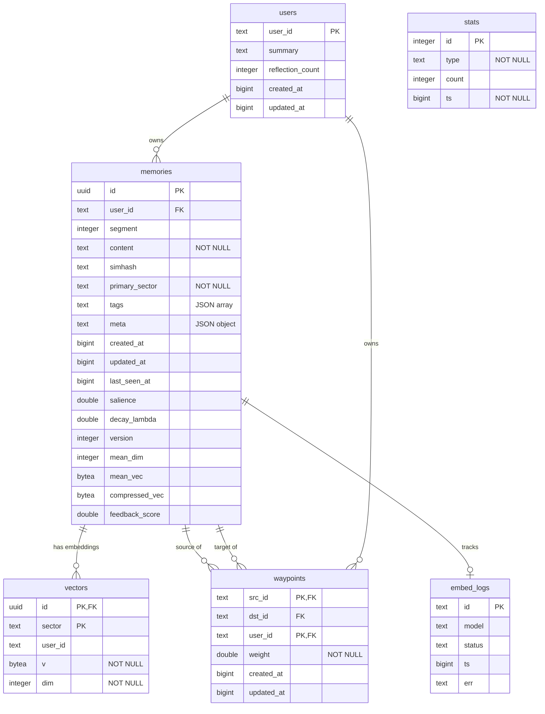
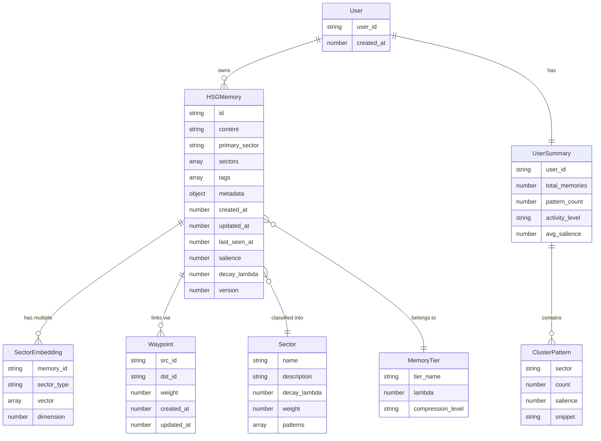
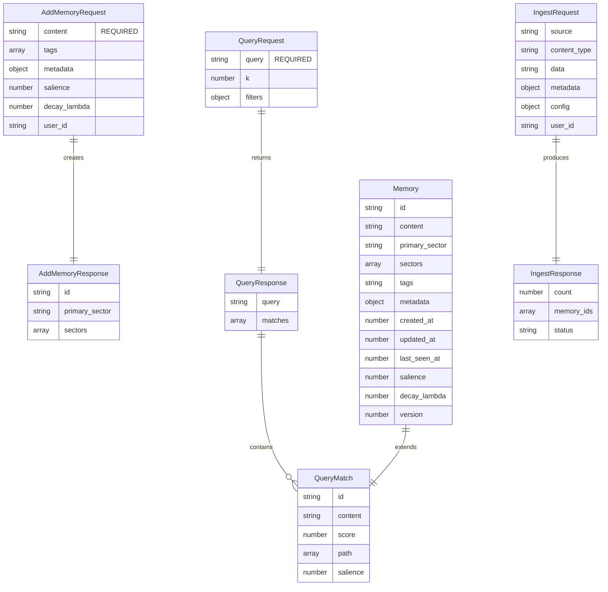
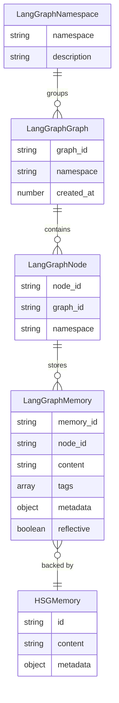
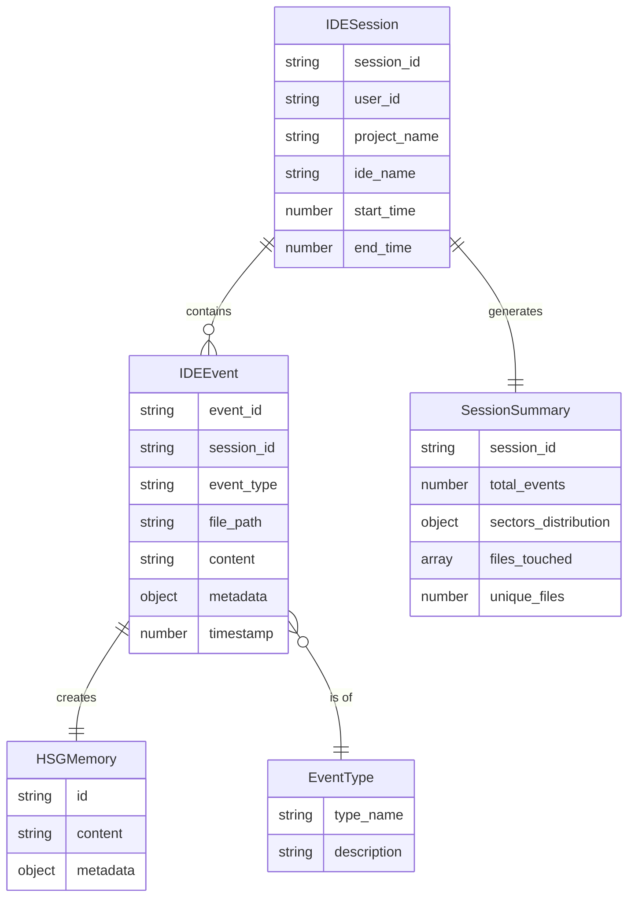
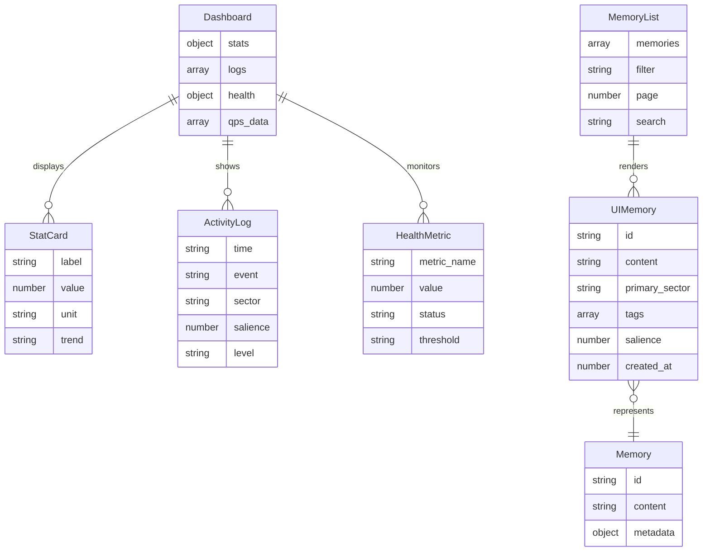
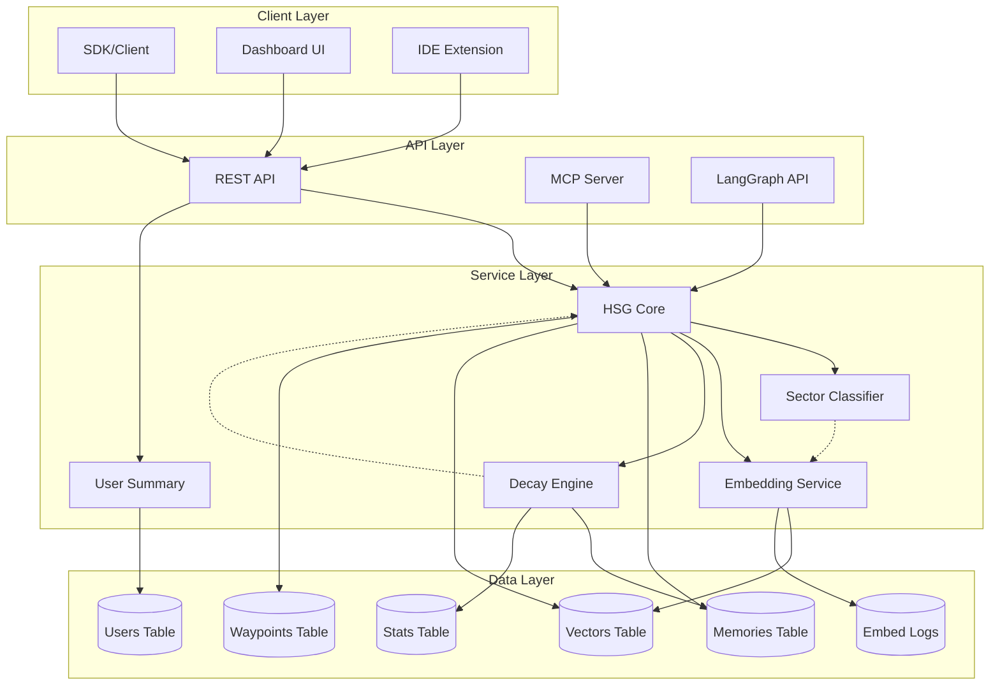
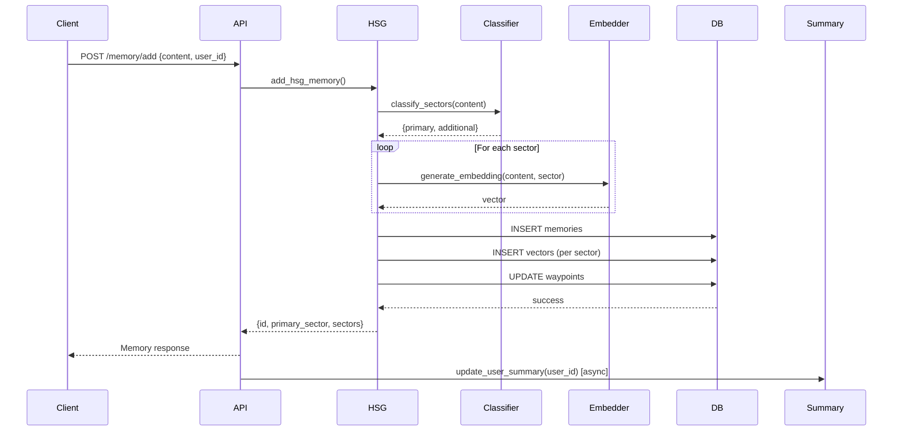
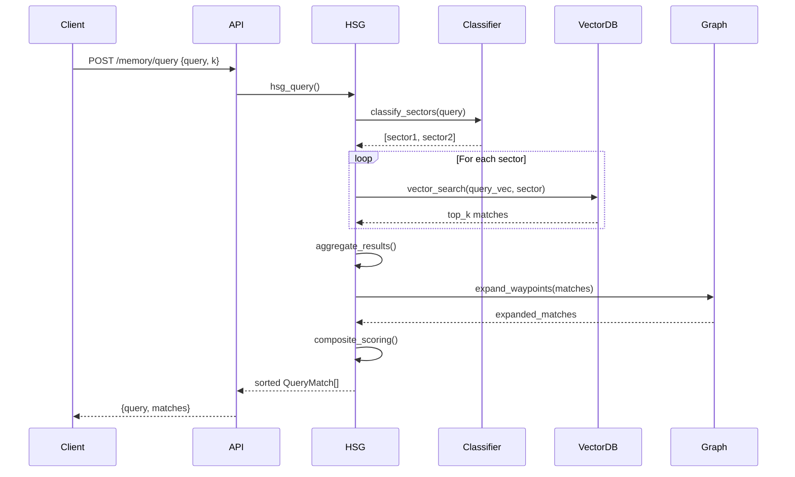
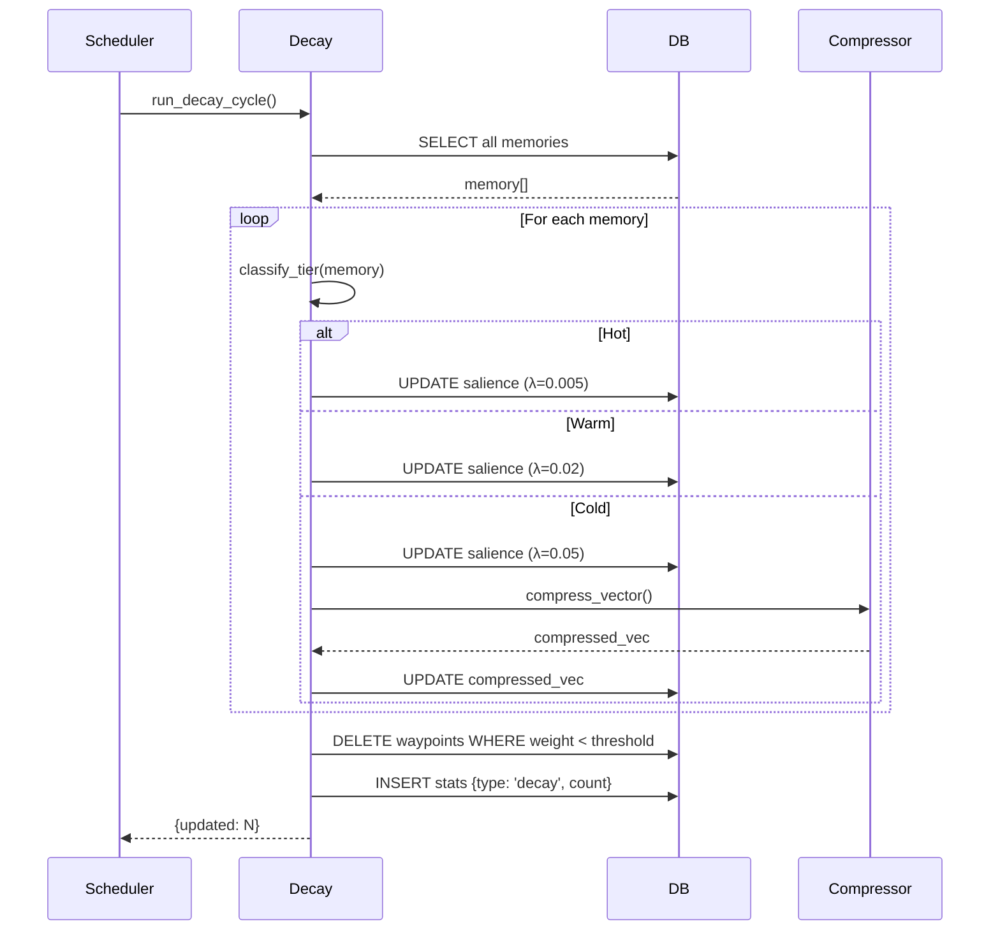

# OpenMemory Entity Relationship Diagram

## Database Schema ERD

## Service Layer Domain Model

## API/SDK Layer Model

## LangGraph Integration Model

## IDE Integration Model

## UI Dashboard Data Flow

## Complete System Architecture

## Data Flow: Add Memory

## Data Flow: Query Memory

## Data Flow: Decay Cycle

---

## Entity Cardinalities

### One-to-Many Relationships

1. **users → memories**: One user has many memories
2. **users → waypoints**: One user has many waypoints
3. **memories → vectors**: One memory has multiple sector embeddings
4. **memories → waypoints (src)**: One memory is source of many waypoints
5. **memories → waypoints (dst)**: One memory is destination of many waypoints

### One-to-One Relationships

1. **memories ↔ embed_logs**: Optional tracking log per memory
2. **users ↔ user summary**: One generated summary per user

### Many-to-Many Relationships

1. **memories ↔ memories (via waypoints)**: Memories form a directed graph
2. **memories ↔ sectors**: Memories can belong to multiple sectors

---

## Indexes and Performance

### Primary Indexes
- `memories(id)` - UUID primary key
- `vectors(id, sector)` - Composite primary key
- `waypoints(src_id, user_id)` - Composite primary key
- `users(user_id)` - Text primary key

### Secondary Indexes
- `memories(user_id)` - User isolation
- `memories(primary_sector)` - Sector filtering
- `memories(simhash)` - Deduplication
- `memories(last_seen_at)` - Recency queries
- `vectors(user_id)` - User isolation
- `waypoints(src_id)` - Graph traversal
- `waypoints(dst_id)` - Reverse graph traversal
- `waypoints(user_id)` - User isolation
- `stats(type, ts)` - Analytics queries

### Query Optimization Patterns

1. **Sector-based sharding**: Partition vector search by sector
2. **User scoping**: Always filter by user_id in multi-tenant
3. **Waypoint pruning**: Delete low-weight edges periodically
4. **Vector compression**: Reduce cold memory dimensions
5. **Batch operations**: Process decay in parallel chunks

---

## Constraints

### Primary Key Constraints
- `memories.id` must be unique UUID
- `vectors(id, sector)` must be unique pair
- `waypoints(src_id, user_id)` must be unique pair
- `users.user_id` must be unique

### Foreign Key Constraints (Logical)
- `vectors.id` references `memories.id`
- `waypoints.src_id` references `memories.id`
- `waypoints.dst_id` references `memories.id`
- `memories.user_id` references `users.user_id`
- `waypoints.user_id` references `users.user_id`

### Data Constraints
- `memories.content` NOT NULL
- `memories.primary_sector` NOT NULL
- `vectors.v` NOT NULL (embedding vector)
- `vectors.dim` NOT NULL
- `waypoints.weight` between 0.0 and 1.0
- `memories.salience` between 0.0 and 1.0

### Business Logic Constraints
- Each memory must have at least 1 sector embedding
- Each memory has exactly 1 primary sector
- Waypoints are single-per-source (one strongest link)
- User summaries regenerated every 30 minutes

---

**Diagram Format:** Mermaid
**Last Updated:** 2025-11-09
**Version:** 2.1.0
